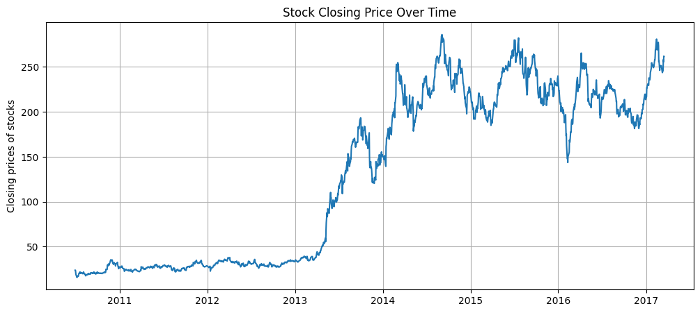
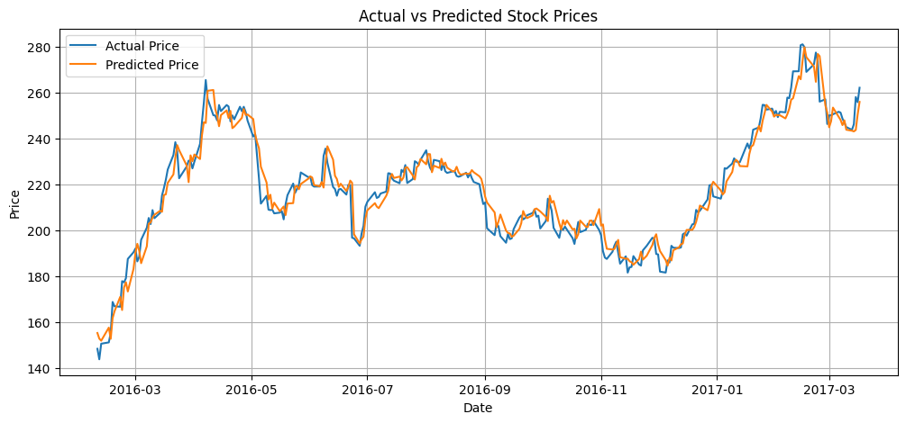

# 📈 Tesla Stock Price Prediction using LSTM (PyTorch)

This project builds a **Long Short-Term Memory (LSTM)** neural network using **PyTorch** to predict Tesla's stock closing prices from historical market data. The model is trained on real OHLCV (Open, High, Low, Close, Volume) data to forecast future prices.

The project demonstrates a full deep learning pipeline including data preprocessing, sequence creation, LSTM architecture design, training, evaluation, and inverse-scaled prediction visualization.

---

## 📌 Table of Contents

- [Project Overview](#project-overview)
- [Technologies Used](#technologies-used)
- [Dataset](#dataset)
- [Data Preprocessing](#data-preprocessing)
- [Sequence Generation](#sequence-generation)
- [Model Architecture](#model-architecture)
- [Model Experiments](#model-experiments)
- [Training Process](#training-process)
- [Evaluation](#evaluation)
- [Results](#results)
- [Project Structure](#project-structure)
- [How to Run](#how-to-run)
- [Future Improvements](#future-improvements)

---

## 📊 Project Overview

The goal is to predict Tesla stock closing prices using an LSTM model built from scratch in PyTorch. The model learns temporal patterns from sequences of past market data (Open, High, Low, Volume) to predict the next closing price.

---

## 🛠 Technologies Used

- Python
- PyTorch
- NumPy
- Pandas
- Matplotlib
- Scikit-learn

---

## 🗂 Dataset

- **Source:** Tesla historical stock data (CSV)
- **Date Range:** 2010-06-29 to 2017-03-17
- **Total Records:** 1,692 trading days
- **Features:** Open, High, Low, Close, Volume, Adj Close
- **Target:** Close price
- **No missing values**

---

## 🔄 Data Preprocessing

- Dropped `Adj Close` column (redundant with `Close`)
- Split features (`Open`, `High`, `Low`, `Volume`) and target (`Close`)
- Train/Test split: **80% / 20%** (no shuffle — preserves time order)
- Applied **MinMaxScaler** with range `(-1, 1)` separately to features and target
- Converted sequences to **PyTorch FloatTensors**
- Used **DataLoader** with batch size `32` and shuffle enabled

---

## 🔁 Sequence Generation

- A sliding window of size **60** is used to generate input sequences
- Each input: 60 timesteps × 4 features
- Each output: the closing price at the next timestep
- This captures temporal dependencies across 3 months of trading history

---

## 🧠 Model Architecture

```
LSTM(
  (lstm): LSTM(input_size=4, hidden_size=128, batch_first=True)
  (linear): Linear(in_features=128, out_features=1)
)
```

- **Input:** 4 features (Open, High, Low, Volume)
- **LSTM Hidden Size:** 128
- **Output:** 1 (predicted closing price)
- **Hidden & Cell states** initialized to zeros each forward pass

---

## 🔬 Model Experiments

### ❌ Initial Model (Overfitting)

| Parameter    | Value |
|--------------|-------|
| Epochs       | 60    |
| num_layers   | 2     |
| hidden_size  | 128   |
| Dropout      | Yes   |

- Model was **overfitting** — training loss dropped but test performance was poor
- Adding dropout with 2 stacked LSTM layers made the model too complex for the data size

### ✅ Improved Model (Final)

| Parameter    | Value |
|--------------|-------|
| Epochs       | 100   |
| num_layers   | 1     |
| hidden_size  | 100   |
| Dropout      | No    |

- Removing dropout and reducing to a single LSTM layer **improved generalization**
- Training for more epochs with a simpler model led to better and more stable test results

---

## 🚀 Training Process

- **Loss Function:** MSELoss
- **Optimizer:** Adam (lr = 0.001)
- **Epochs:** 100
- **Batch Size:** 32
- **Device:** Apple (Mac) MPS / CPU
- **Training Duration:** ~31 seconds

Training uses backpropagation through time (BPTT) to minimize mean squared error between predicted and actual closing prices.

---

## 📈 Evaluation

Predictions are inverse-transformed back to original price scale using the fitted `y_scaler`.

| Metric    | Train Set | Test Set |
|-----------|-----------|----------|
| **RMSE**  | 4.60      | 5.64     |
| **MAE**   | 2.79      | 4.26     |

- Low train/test gap indicates **good generalization**
- Model captures overall trend and price movement patterns effectively

---

## 📊 Results

### 📉 Tesla Closing Price Over Time


- Actual vs Predicted prices plotted over the test period
- Model closely tracks real closing prices across the test window
- Predictions smoothly follow upward and downward price trends



---

## 📂 Project Structure

```text
Tesla-Stock-LSTM
│
├── Tesla.csv
├── tesla_lstm.ipynb
└── README.md
```

---

## ▶️ How to Run

### Clone Repository

```bash
git clone https://github.com/sushil0126/Tesla-Stock-LSTM.git
```

### Install Dependencies

```bash
pip install torch numpy pandas matplotlib scikit-learn
```

### Run Notebook

```bash
jupyter notebook tesla_lstm.ipynb
```

---

## 🔮 Future Improvements

- Add multiple LSTM layers (stacked LSTM)
- Add Dropout for regularization
- Use Bidirectional LSTM
- Incorporate more features (e.g., technical indicators like RSI, MACD)
- Experiment with GRU or Transformer-based models
- Add learning rate scheduler
- Deploy as a real-time prediction dashboard using Streamlit 